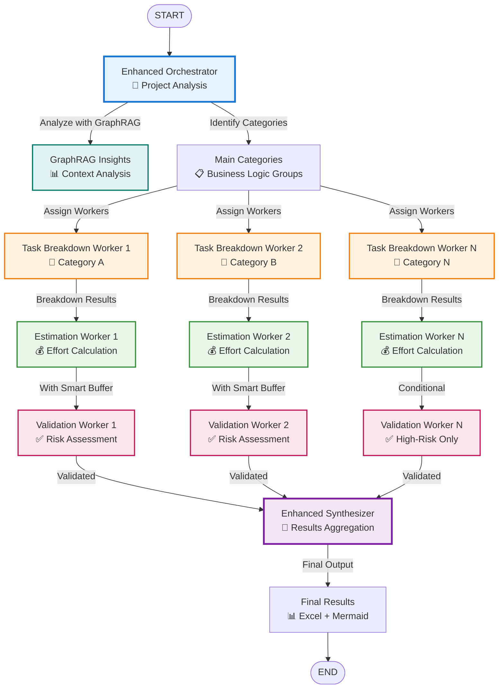
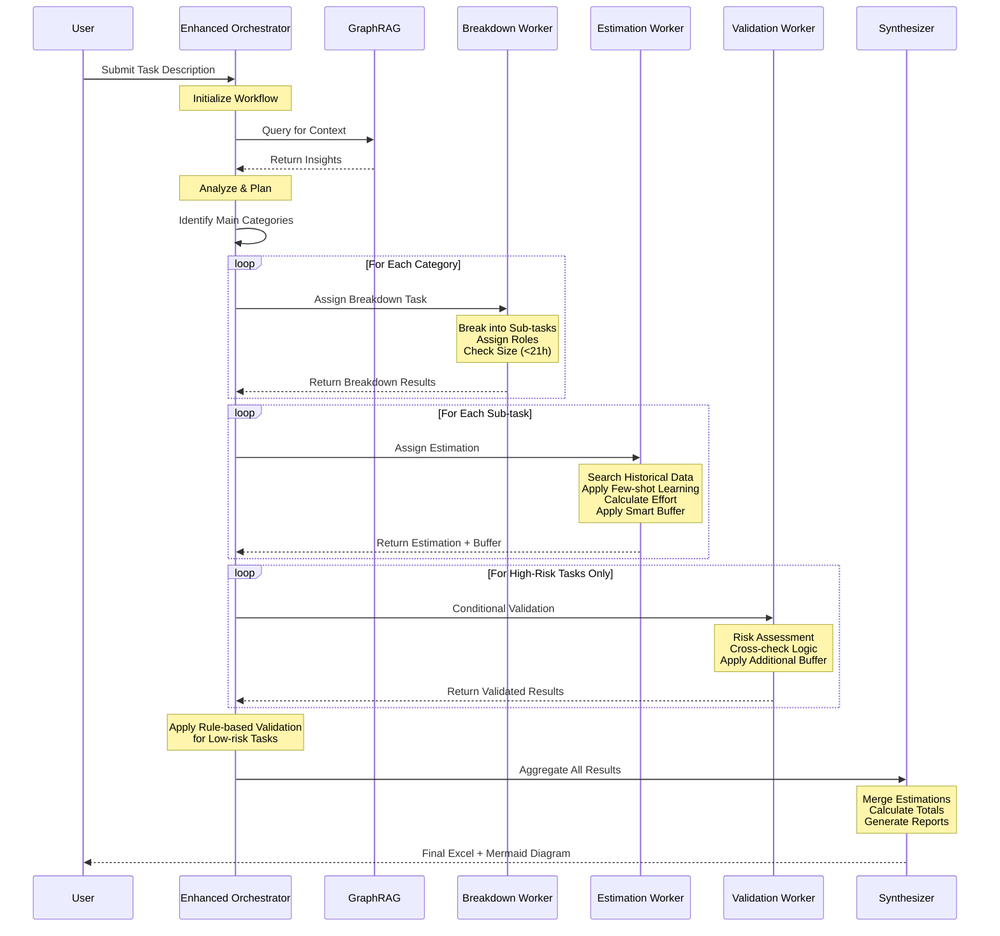
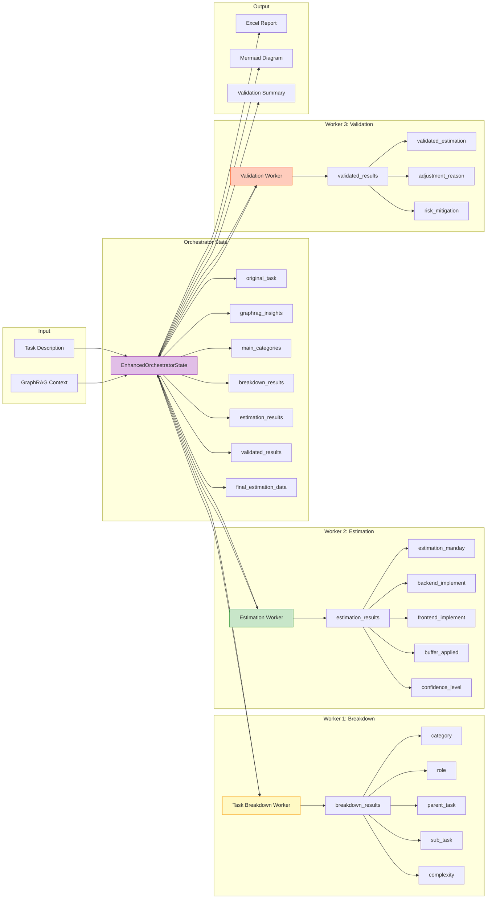
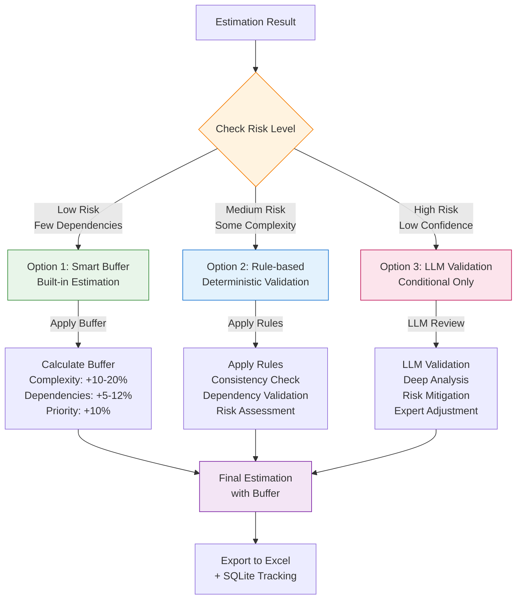
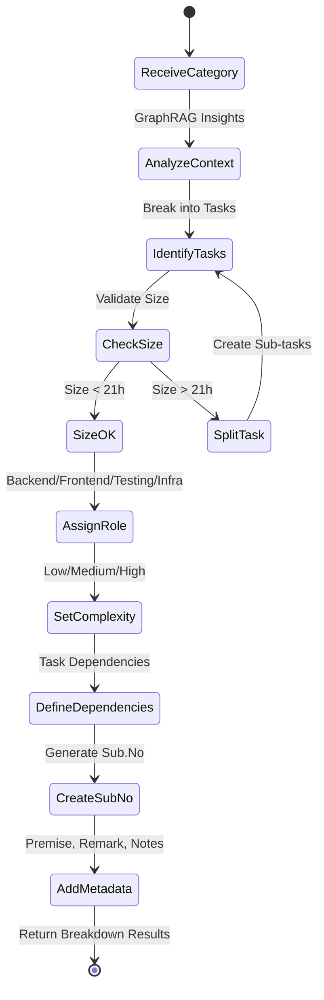
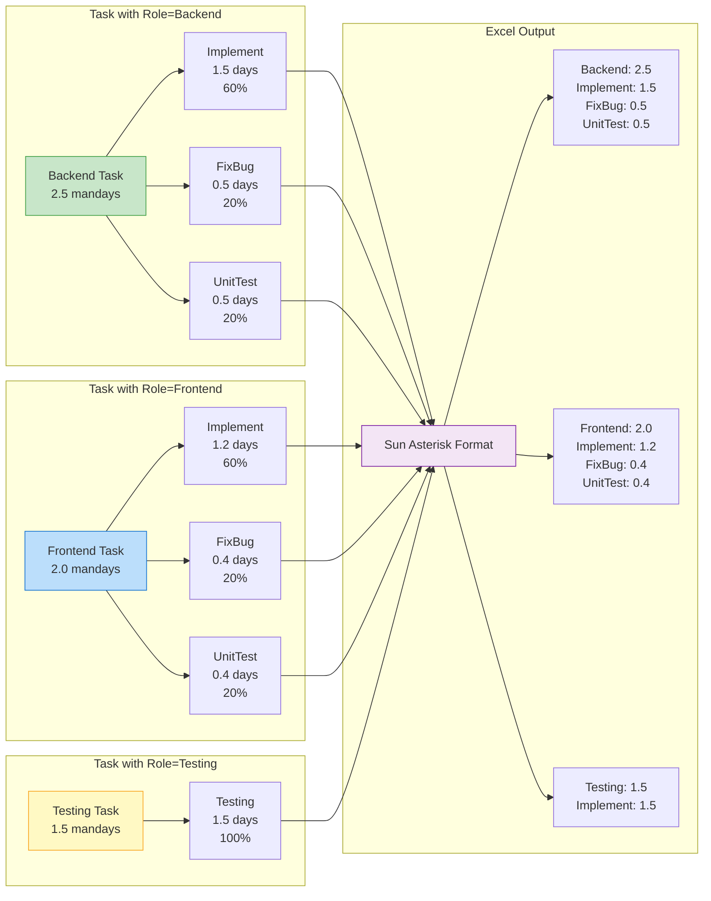
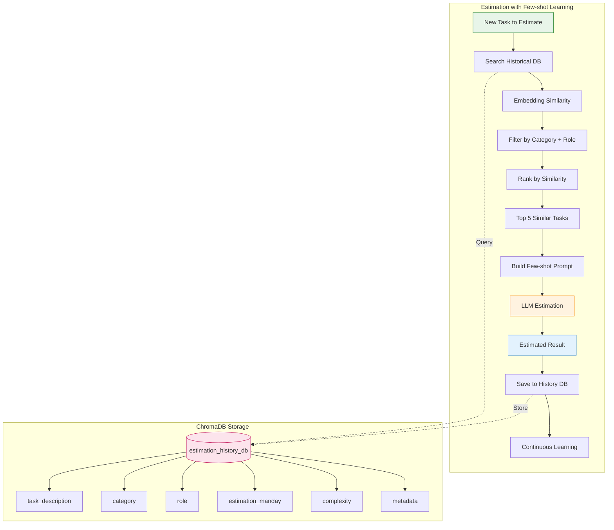
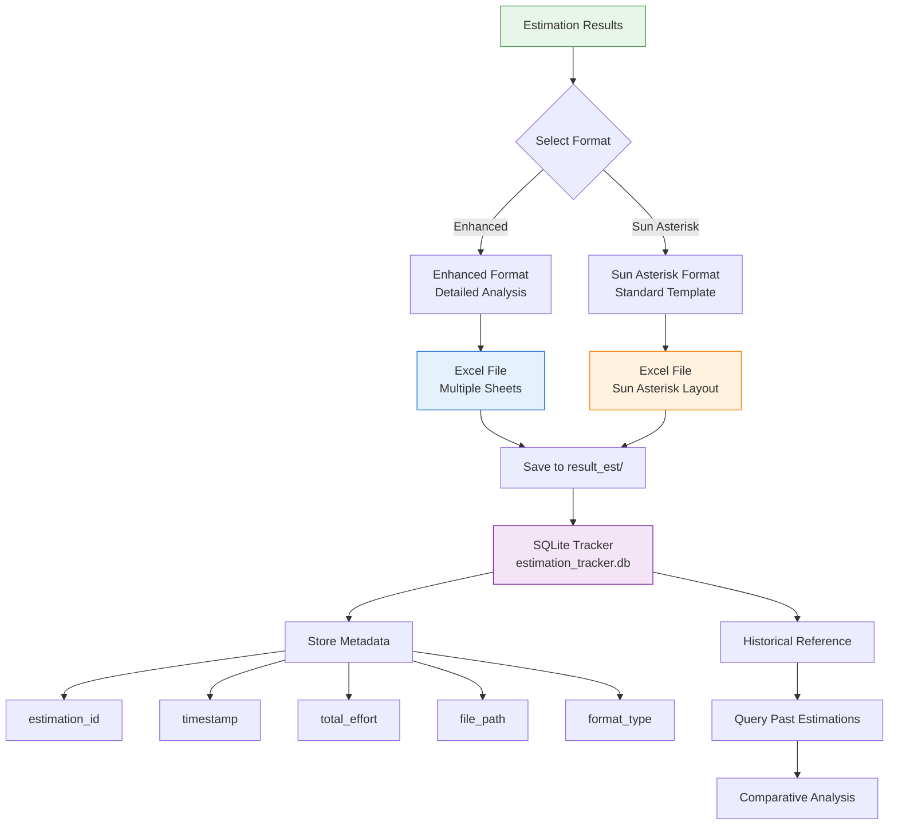
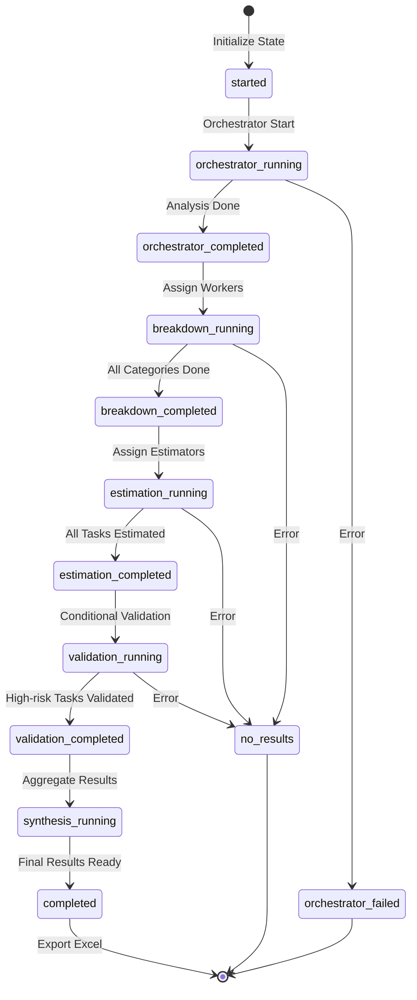
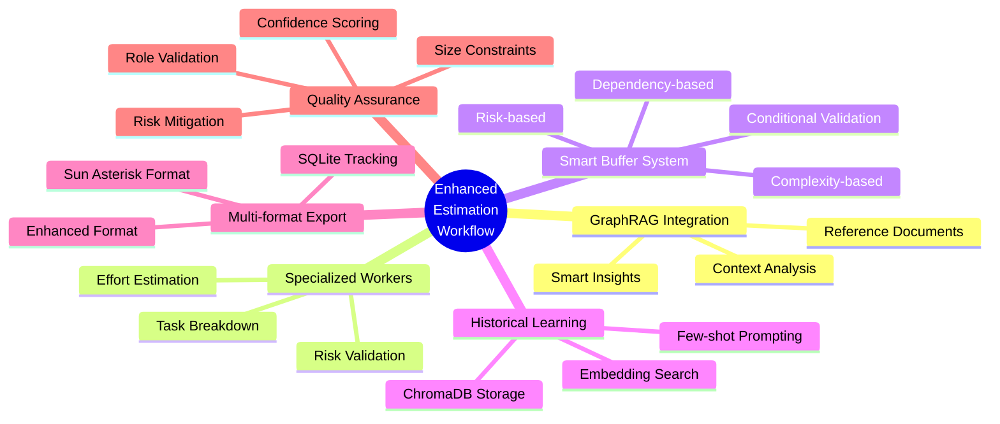

# Enhanced Estimation Workflow Diagram

## Overview Architecture

## Detailed Worker Flow

## Data Flow Architecture

## Buffer & Validation Strategy

## Task Breakdown Process

## Role-specific Estimation Breakdown

## Historical Data Integration

## Export & Tracking System

## State Management Flow

## Key Features Summary

---

## Notes

- **Orchestrator**: Phân tích task gốc và chia thành categories
- **Worker 1**: Break down mỗi category thành các sub-tasks cụ thể (<21h)
- **Worker 2**: Estimate effort với few-shot learning và smart buffer
- **Worker 3**: Validate conditional cho high-risk tasks only
- **Synthesizer**: Tổng hợp kết quả và tạo reports

**Buffer Strategy**:
- Option 1: Built-in smart buffer (all tasks)
- Option 2: Rule-based validation (low-risk tasks)
- Option 3: LLM validation (high-risk tasks only)

**Export Formats**:
- Enhanced: Detailed analysis với multiple sheets
- Sun Asterisk: Standard template theo quy định
