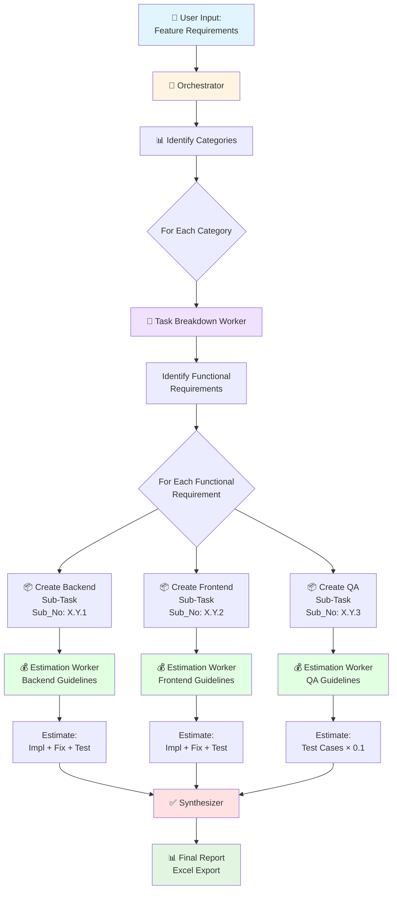
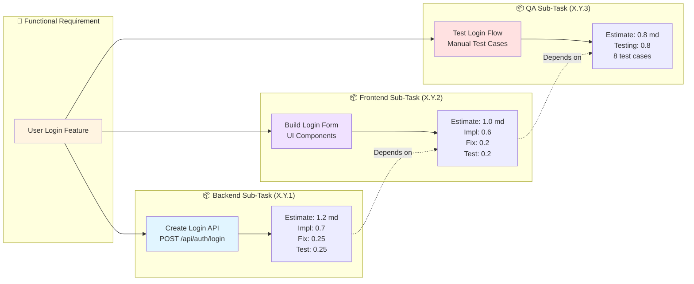

# Multi-Role Workflow Architecture - Visual Diagram

## High-Level Flow



## Detailed Breakdown Flow



## Role-Specific Estimation Guidelines

```mermaid
graph TD
    subgraph "🔵 Backend Estimation"
        BE_INPUT[Task Input:<br/>API/Database Work]
        BE_ASSESS[Assess Complexity:<br/>Simple CRUD vs Complex Logic]
        BE_SPLIT[Split Effort:<br/>60% Implement<br/>20% FixBug<br/>20% UnitTest]
        BE_RANGE[Typical Range:<br/>0.5 - 2.5 mandays]
        
        BE_INPUT --> BE_ASSESS
        BE_ASSESS --> BE_SPLIT
        BE_SPLIT --> BE_RANGE
    end
    
    subgraph "🟣 Frontend Estimation"
        FE_INPUT[Task Input:<br/>UI/Component Work]
        FE_ASSESS[Assess Complexity:<br/>Simple Form vs Complex Component]
        FE_SPLIT[Split Effort:<br/>60% Implement<br/>20% FixBug<br/>20% UnitTest]
        FE_RANGE[Typical Range:<br/>0.5 - 2.5 mandays]
        
        FE_INPUT --> FE_ASSESS
        FE_ASSESS --> FE_SPLIT
        FE_SPLIT --> FE_RANGE
    end
    
    subgraph "🔴 QA Estimation (Manual Testing)"
        QA_INPUT[Task Input:<br/>Feature to Test]
        QA_COUNT[Count Test Cases:<br/>Inputs + Logic + Integration]
        QA_CALC[Calculate:<br/>Test Cases × 0.1 manday]
        QA_RANGE[Typical Range:<br/>5-30 test cases<br/>0.5 - 3.0 mandays]
        
        QA_INPUT --> QA_COUNT
        QA_COUNT --> QA_CALC
        QA_CALC --> QA_RANGE
    end
    
    style BE_INPUT fill:#e1f5ff
    style BE_SPLIT fill:#c2e5ff
    style FE_INPUT fill:#f0e1ff
    style FE_SPLIT fill:#e1c2ff
    style QA_INPUT fill:#ffe1e1
    style QA_CALC fill:#ffc2c2
```



## Sub_No Numbering Pattern

```
Category 1: User Management
├── Functional Task 1.1: User Login
│   ├── 1.1.1 (Backend)   ← Z=1 for Backend
│   ├── 1.1.2 (Frontend)  ← Z=2 for Frontend
│   └── 1.1.3 (QA)        ← Z=3 for QA
│
├── Functional Task 1.2: User Registration
│   ├── 1.2.1 (Backend)
│   ├── 1.2.2 (Frontend)
│   └── 1.2.3 (QA)
│
└── Functional Task 1.3: Password Reset
    ├── 1.3.1 (Backend)
    ├── 1.3.2 (Frontend)
    └── 1.3.3 (QA)

Category 2: Product Catalog
├── Functional Task 2.1: Product Search
│   ├── 2.1.1 (Backend)
│   ├── 2.1.2 (Frontend)
│   └── 2.1.3 (QA)
│
└── Functional Task 2.2: Product Details
    ├── 2.2.1 (Backend)
    ├── 2.2.2 (Frontend)
    └── 2.2.3 (QA)

Pattern: X.Y.Z
- X = Category number (1, 2, 3, ...)
- Y = Functional task within category (1, 2, 3, ...)
- Z = Role (1=Backend, 2=Frontend, 3=QA)
```

## Data Model Structure

```
TaskBreakdown {
    id: "unique_id_backend_task_1"
    functional_task_id: "login_feature_001"  ← Links related tasks
    is_role_specific_subtask: true
    
    category: "User Management"
    parent_task: "User Login Feature"
    sub_task: "Create Login API Endpoint"
    sub_no: "1.1.1"
    role: "Backend"
    
    description: "Implement POST /api/auth/login..."
    complexity: "Medium"
    priority: "High"
    
    estimation_manday: 1.2
    backend_implement: 0.7
    backend_fixbug: 0.25
    backend_unittest: 0.25
    frontend_implement: 0.0  ← Zero for other roles
    frontend_fixbug: 0.0
    frontend_unittest: 0.0
    testing_implement: 0.0
}

TaskBreakdown {
    id: "unique_id_frontend_task_1"
    functional_task_id: "login_feature_001"  ← Same link
    is_role_specific_subtask: true
    
    category: "User Management"
    parent_task: "User Login Feature"
    sub_task: "Build Login UI Form"
    sub_no: "1.1.2"
    role: "Frontend"
    
    estimation_manday: 1.0
    backend_implement: 0.0  ← Zero for other roles
    backend_fixbug: 0.0
    backend_unittest: 0.0
    frontend_implement: 0.6
    frontend_fixbug: 0.2
    frontend_unittest: 0.2
    testing_implement: 0.0
}

TaskBreakdown {
    id: "unique_id_qa_task_1"
    functional_task_id: "login_feature_001"  ← Same link
    is_role_specific_subtask: true
    
    category: "User Management"
    parent_task: "User Login Feature"
    sub_task: "Test Login Flow"
    sub_no: "1.1.3"
    role: "QA"
    
    estimation_manday: 0.8
    backend_implement: 0.0  ← Zero for dev work
    backend_fixbug: 0.0
    backend_unittest: 0.0
    frontend_implement: 0.0
    frontend_fixbug: 0.0
    frontend_unittest: 0.0
    testing_implement: 0.8  ← 100% testing
}
```

## Example: Complete Feature Breakdown

```
🎯 Feature: "User Login with Email & Password"

📦 1.1.1 Backend: Create Login API
   Description: Implement POST /api/auth/login endpoint
   - JWT token generation
   - Password validation
   - Database user lookup
   - Error handling
   
   Estimation: 1.2 mandays
   ├── Implement: 0.7 md (API logic, validation, JWT)
   ├── FixBug: 0.25 md (refinement, edge cases)
   └── UnitTest: 0.25 md (endpoint tests)

📦 1.1.2 Frontend: Build Login Form
   Description: Create login form component
   - Email/password inputs
   - Client-side validation
   - Error message display
   - Loading states
   
   Estimation: 1.0 mandays
   ├── Implement: 0.6 md (UI components, validation)
   ├── FixBug: 0.2 md (polish, responsiveness)
   └── UnitTest: 0.2 md (component tests)

📦 1.1.3 QA: Test Login Flow
   Description: Manual test cases for login
   - Valid credentials (1 case)
   - Invalid email format (1 case)
   - Invalid password (1 case)
   - Empty fields (2 cases)
   - SQL injection (1 case)
   - Account locked (1 case)
   - Network errors (1 case)
   
   Estimation: 0.8 mandays
   └── Testing: 0.8 md (8 test cases × 0.1)

Total Feature Effort: 3.0 mandays
```

---

**Diagram Created**: 2025-10-14  
**For**: Multi-Role Workflow Architecture  
**Status**: ✅ Complete
