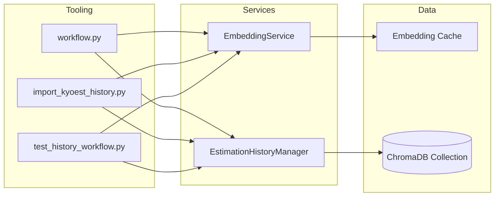

# Core Services & Dependencies

## EmbeddingService
- Wraps OpenAI `text-embedding-3-small` for 1,536-dimension vectors ([IMPLEMENTATION_SUMMARY.md:28](../../IMPLEMENTATION_SUMMARY.md:28)).
- Provides singleton access, batch generation, and local file caching to minimize cost ([IMPLEMENTATION_SUMMARY.md:30](../../IMPLEMENTATION_SUMMARY.md:30)).
- Exposed through `get_embedding_service()` for reuse across scripts and workers ([ESTIMATION_HISTORY_GUIDE.md:88](../../ESTIMATION_HISTORY_GUIDE.md:88)).

## EstimationHistoryManager
- Manages the ChromaDB collection `estimation_history` ([IMPLEMENTATION_SUMMARY.md:42](../../IMPLEMENTATION_SUMMARY.md:42)).
- Handles save/search operations, builds few-shot prompts, and surfaces statistics for monitoring ([IMPLEMENTATION_SUMMARY.md:44](../../IMPLEMENTATION_SUMMARY.md:44); [test_history_workflow.py:64](../../test_history_workflow.py:64)).
- Available via `get_history_manager()` singleton to ensure consistent database access ([ESTIMATION_HISTORY_GUIDE.md:83](../../ESTIMATION_HISTORY_GUIDE.md:83)).

## Migration Script
- `migration_scripts/import_kyoest_history.py` migrates real-world tasks from `kyoest.md`, generates embeddings, and bulk loads the database ([IMPLEMENTATION_SUMMARY.md:48](../../IMPLEMENTATION_SUMMARY.md:48)).
- Validates multilingual descriptions (JP + VN) and attaches metadata such as category, role, complexity ([IMPLEMENTATION_SUMMARY.md:50](../../IMPLEMENTATION_SUMMARY.md:50)).

## Supporting Assets
- Configuration knobs live in `config.py` for db paths, model choice, similarity threshold, and max examples ([IMPLEMENTATION_SUMMARY.md:74](../../IMPLEMENTATION_SUMMARY.md:74)).
- Test harness `test_history_workflow.py` exercises embedding generation, persistence, prompt building, and integration ([test_history_workflow.py:1](../../test_history_workflow.py:1)).
- Documentation (`ESTIMATION_HISTORY_GUIDE.md`, `IMPLEMENTATION_SUMMARY.md`) provides onboarding, usage, and architectural diagrams ([IMPLEMENTATION_SUMMARY.md:82](../../IMPLEMENTATION_SUMMARY.md:82)).

> See Operations → Setup for install and migration steps once you understand which components you need.
