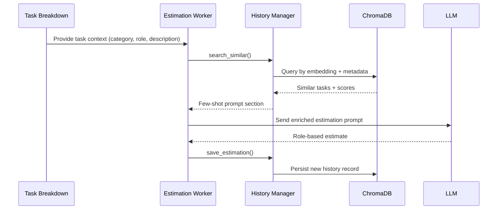

# Estimation Worker Enhancements

The estimation worker gained a semantic-memory layer so every estimate benefits from prior art.

## New Responsibilities
1. **Search history first**: Query the ChromaDB collection for tasks that match description, category, and role ([IMPLEMENTATION_SUMMARY.md:64](../../IMPLEMENTATION_SUMMARY.md:64)).
2. **Assemble few-shot context**: Build a prompt with top N similar tasks including similarity scores and effort figures ([IMPLEMENTATION_SUMMARY.md:68](../../IMPLEMENTATION_SUMMARY.md:68); [ESTIMATION_HISTORY_GUIDE.md:72](../../ESTIMATION_HISTORY_GUIDE.md:72)).
3. **Estimate with context**: Feed the LLM the enriched prompt so it adapts to historical patterns ([IMPLEMENTATION_SUMMARY.md:68](../../IMPLEMENTATION_SUMMARY.md:68)).
4. **Persist results**: Save successful estimations back into history for continuous learning ([IMPLEMENTATION_SUMMARY.md:70](../../IMPLEMENTATION_SUMMARY.md:70)).

## Architectural Placement
```
Task Breakdown
    ↓
Estimation Worker ──► EstimationHistoryManager ──► ChromaDB
    ↓                               ↓
Few-shot Prompt                 Historical Similarities
```
Derived from the full system diagram in [IMPLEMENTATION_SUMMARY.md:108](../../IMPLEMENTATION_SUMMARY.md:108).



## Fallback Behaviour
- If no similar tasks exceed the threshold, the worker continues with a standard prompt, ensuring resilience ([IMPLEMENTATION_SUMMARY.md:70](../../IMPLEMENTATION_SUMMARY.md:70)).
- Threshold and max examples configurable via `config.py` ([IMPLEMENTATION_SUMMARY.md:74](../../IMPLEMENTATION_SUMMARY.md:74)).

## Why It Matters
- Reduces manual effort to find precedents.
- Creates consistent language and effort framing across estimates.
- Ensures every new estimation contributes back to the corpus, compounding value over time.

> For the bigger workflow picture, review Estimation Workflow → End-to-End Estimation Flow.
