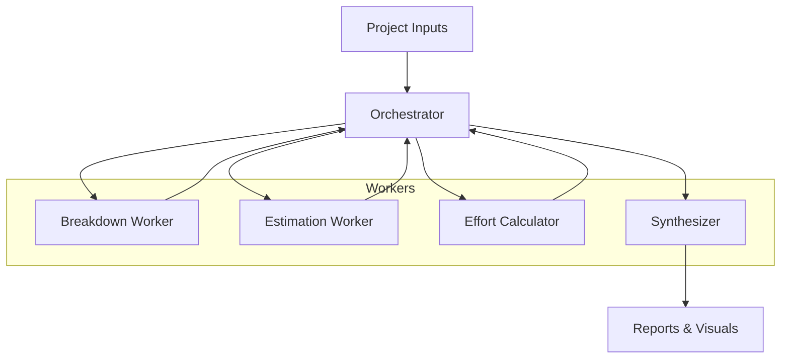

# LangGraph Workflow Design

Our orchestration pattern follows the orchestrator–worker blueprint captured during initial architecture planning ([think.md:1](../../think.md:1)).

## Orchestrator Responsibilities
- Build the LangGraph workflow that sequences task breakdown, estimation, effort synthesis, and reporting.
- Route intermediate results between workers while maintaining project context.
- Trigger the synthesizer to compile outputs (tables, Excel, visualizations) once workers finish ([think.md:15](../../think.md:15)).

## Worker Line-up
1. **Breakdown Worker**
   - Generates business categories, parent tasks, child tasks, and descriptions using graph-based retrieval prompts ([think.md:8](../../think.md:8)).
2. **Estimation Worker**
   - Calculates per-task effort with few-shot context (see Architecture → Estimation Worker Enhancements).
3. **Effort Calculator**
   - Aggregates task-level estimates into effort distributions suitable for reporting ([think.md:11](../../think.md:11)).

## Synthesizer Duties
- Consolidate worker outputs into the estimation table format required by stakeholders (JP/EN mixed headers included) ([think.md:16](../../think.md:16)).
- Produce optional Excel exports and mermaid diagrams to visualize workflow dependencies ([think.md:19](../../think.md:19)).

## Design Constraints
- Tailor outputs for a mid-level developer audience (≈3 years experience) to keep estimates realistic ([think.md:29](../../think.md:29)).
- Balance automation with transparency: every worker’s result should be inspectable before sign-off.

> The orchestrator keeps business logic front-and-center by partnering with the role-based breakdown described in Estimation Workflow → Task Breakdown & Role Effort Rules.
