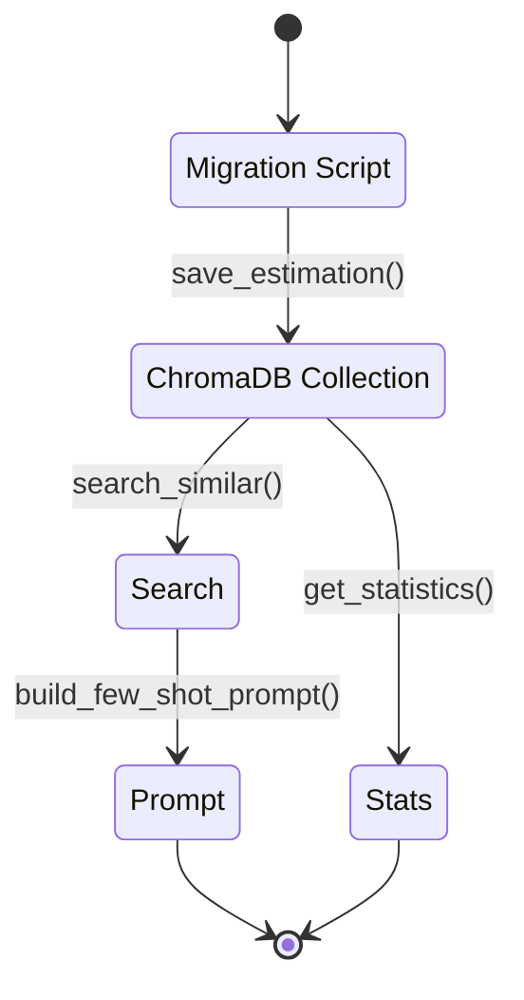

# ChromaDB Schema & Operations

ChromaDB stores the canonical estimation history that powers semantic search and analytics.

## Collection Layout
- Collection name: `estimation_history` ([IMPLEMENTATION_SUMMARY.md:96](../../IMPLEMENTATION_SUMMARY.md:96)).
- Each record contains metadata, a document payload, and a 1,536-dim embedding vector.
- Metadata fields cover project, category, role, task hierarchy, effort split, confidence, timestamps, and validation flag ([IMPLEMENTATION_SUMMARY.md:100](../../IMPLEMENTATION_SUMMARY.md:100)).

## Metadata Example
```python
{
    'project_name': 'kyoest_historical',
    'category': '見積/受注',
    'role': 'Backend',
    'parent_task': '見込データ作成',
    'sub_task': 'データ入力画面の実装',
    'complexity': 'Medium',
    'priority': 'High',
    'estimation_manday': 4.5,
    'estimation_backend_manday': 4.5,
    'estimation_frontend_manday': 0.0,
    'estimation_qa_manday': 0.0,
    'estimation_infra_manday': 0.0,
    'confidence_level': 0.85,
    'created_at': '2025-10-03T…',
    'validated': True
}
```
([ESTIMATION_HISTORY_GUIDE.md:122](../../ESTIMATION_HISTORY_GUIDE.md:122))

## Core Operations
- **Save estimation**: `history_manager.save_estimation(task_dict, project_name)` stores task metadata + document ([test_history_workflow.py:64](../../test_history_workflow.py:64)).
- **Semantic search**: `search_similar(description, category, role, top_k, similarity_threshold)` filters by metadata and similarity ([test_history_workflow.py:85](../../test_history_workflow.py:85)).
- **Few-shot prompt build**: `build_few_shot_prompt(similar_tasks, max_examples)` formats results for LLM consumption ([test_history_workflow.py:104](../../test_history_workflow.py:104)).
- **Statistics**: `get_statistics()` returns counts, averages, role splits to monitor data quality ([test_history_workflow.py:113](../../test_history_workflow.py:113)).

## Performance Profile
- <50 ms search latency for ~100 tasks; <200 ms for ~1,000 tasks ([ESTIMATION_HISTORY_GUIDE.md:156](../../ESTIMATION_HISTORY_GUIDE.md:156)).
- Metadata filtering keeps result sets small and focused.

## Maintenance Tips
- To reset the store, delete `./estimation_history_db/` and rerun the migration script ([ESTIMATION_HISTORY_GUIDE.md:200](../../ESTIMATION_HISTORY_GUIDE.md:200)).
- Monitor similarity thresholds: start at 0.6, adjust per use case (see Estimation Workflow → Historical Context Builder).



> Pair this guide with Data Intelligence → Embedding Service & Cache to understand how vectors are generated and reused.
