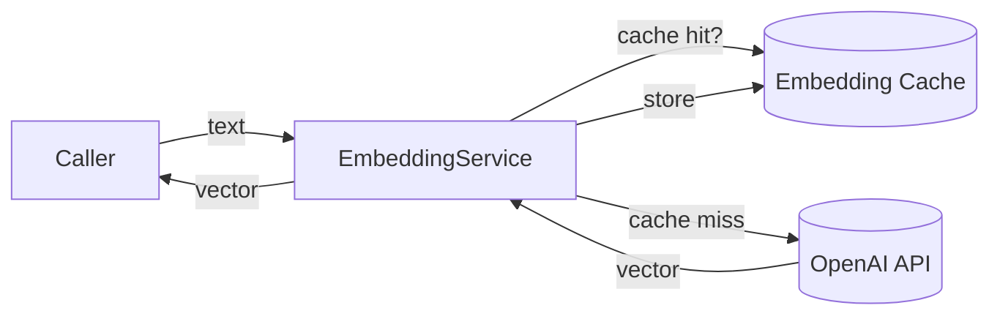

# Embedding Service & Cache

Semantic search relies on high-quality embeddings produced by `EmbeddingService`.

## Model Choice
- Uses OpenAI `text-embedding-3-small` for a cost-effective 1,536-dimension representation ([IMPLEMENTATION_SUMMARY.md:122](../../IMPLEMENTATION_SUMMARY.md:122)).
- Cost ≈ $0.020 / 1M tokens; 30 tasks consume ~3,000 tokens (~$0.00006) ([IMPLEMENTATION_SUMMARY.md:136](../../IMPLEMENTATION_SUMMARY.md:136)).

## Service Features
- Singleton pattern ensures one client/cacher per process ([IMPLEMENTATION_SUMMARY.md:30](../../IMPLEMENTATION_SUMMARY.md:30)).
- Batch embedding methods accelerate imports and reduce request overhead ([IMPLEMENTATION_SUMMARY.md:28](../../IMPLEMENTATION_SUMMARY.md:28)).
- File-based cache (`./embedding_cache`) serves repeat texts instantly ([IMPLEMENTATION_SUMMARY.md:130](../../IMPLEMENTATION_SUMMARY.md:130); [test_history_workflow.py:36](../../test_history_workflow.py:36)).

## API Usage
```python
from utils.embedding_service import get_embedding_service
service = get_embedding_service()
embedding = service.generate_embedding("Task description")
embeddings = service.generate_batch_embeddings(["Task 1", "Task 2"])
```
([ESTIMATION_HISTORY_GUIDE.md:88](../../ESTIMATION_HISTORY_GUIDE.md:88))

## Caching Behaviour
- First call generates and caches; subsequent calls hit the filesystem cache in <1 ms ([test_history_workflow.py:48](../../test_history_workflow.py:48)).
- Cache directory persists across sessions—include it in environment documentation or .gitignore as needed.

## Operational Notes
- If cache misses increase unexpectedly, confirm the text normalization logic in callers and check disk permissions.
- Batch operations are more efficient than sequential single calls (see migration script implementation).



> Ensure the OpenAI API key is configured per Operations → Environment & Data Import Runbook before testing embeddings.
