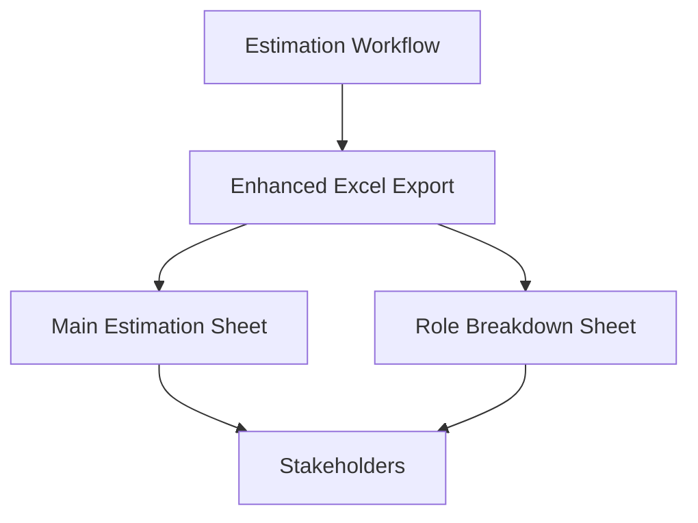

# Excel Export & Role Breakdown

Excel remains the lingua franca for many stakeholders, so the export mirrors their expectations while adding role intelligence.

## Main Estimation Sheet
- Columns include `role`, per-role mandays, total mandays, and confidence to communicate ownership and effort split ([CHANGES.md:60](../../CHANGES.md:60)).
- Layout aligns with the synthesized table defined in the architectural notes to ease cross-checks ([think.md:18](../../think.md:18)).

## Role Breakdown Sheet
- Summarizes task count, total effort, average effort, and percentage share per role ([CHANGES.md:64](../../CHANGES.md:64)).
- Enables quick resource planning conversations with engineering managers.

## Example Output
```
Role      | Task Count | Total Effort | Average Effort | Percentage
Backend   | 15         | 45.5         | 3.0            | 45.5%
Frontend  | 12         | 30.0         | 2.5            | 30.0%
QA        | 8          | 15.0         | 1.9            | 15.0%
Infra     | 5          | 9.5          | 1.9            | 9.5%
```
([CHANGES.md:72](../../CHANGES.md:72))

## Distribution Workflow
1. Run estimation workflow.
2. Export Excel via the synthesizer utilities.
3. Share role breakdown sheet with PM/EM; use main sheet for engineering sign-off.



> Refer to Operations → Environment & Data Import Runbook for the steps required before exporting (dependencies, migrations, etc.).
