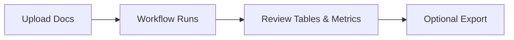

# Streamlit Touchpoints

The Streamlit app showcases role-aware estimation data so stakeholders can review results instantly.

## Task Breakdown Table
- Displays category, role, backend/frontend/QA/infra days, total mandays, and confidence side-by-side ([CHANGES.md:90](../../CHANGES.md:90)).
- Highlights business categories first to keep conversations centered on product outcomes rather than tech stacks ([CHANGES.md:8](../../CHANGES.md:8)).

## Role Summary Metrics
- Aggregates total effort per role and surfaces quick stats (e.g., Backend: X.X days) for capacity planning ([CHANGES.md:94](../../CHANGES.md:94)).
- Helps team leads spot bottlenecks before sprint planning.

## User Flow
1. Upload project documentation.
2. Wait for orchestrator to run breakdown, estimation, validation, and synthesis.
3. Review the Streamlit tables/metrics to confirm effort distribution and confidence before exporting or sharing.

## Tips for Demos
- Pair UI reviews with real historical matches from Estimation Workflow → Historical Context Builder to explain how the numbers were derived.
- Capture screenshots for onboarding decks so new team members recognize the default layout immediately.
