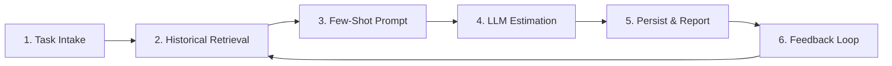

# End-to-End Estimation Flow

The workflow blends fresh user input with historical intelligence to deliver accurate estimates.

## 1. Task Intake
- Orchestrator receives project context + requirements and invokes the breakdown worker to structure tasks by business category ([think.md:6](../../think.md:6)).

## 2. Historical Context Retrieval
- Estimation worker queries EstimationHistoryManager for similar tasks (see Architecture → Estimation Worker Enhancements) ([IMPLEMENTATION_SUMMARY.md:64](../../IMPLEMENTATION_SUMMARY.md:64)).
- Similarity filters: category, role, description semantics, adjustable threshold ([IMPLEMENTATION_SUMMARY.md:74](../../IMPLEMENTATION_SUMMARY.md:74)).

## 3. Few-Shot Prompt Assembly
- Top matches converted into a prompt section with similarity scores, effort, and confidence ([ESTIMATION_HISTORY_GUIDE.md:70](../../ESTIMATION_HISTORY_GUIDE.md:70)).
- Balances 3–5 examples for optimal context vs token usage ([ESTIMATION_HISTORY_GUIDE.md:148](../../ESTIMATION_HISTORY_GUIDE.md:148)).

## 4. LLM Estimation
- LLM returns per-task manday estimate with role distribution. Validation worker adjusts totals while preserving role ratios ([CHANGES.md:46](../../CHANGES.md:46)).

## 5. Persistence & Reporting
- Successful estimates are stored back into ChromaDB, enriching future searches ([IMPLEMENTATION_SUMMARY.md:70](../../IMPLEMENTATION_SUMMARY.md:70)).
- Synthesizer compiles outputs into tables, Excel, and optional mermaid visualizations ([think.md:16](../../think.md:16)).

## 6. Feedback Loop
- Test suite validates embedding, history, prompt, and workflow integration to ensure regressions are caught early ([test_history_workflow.py:1](../../test_history_workflow.py:1)).
- Future projects inherit richer history, reinforcing estimation accuracy over time ([IMPLEMENTATION_SUMMARY.md:174](../../IMPLEMENTATION_SUMMARY.md:174)).

> To understand how roles influence estimation math, jump to Task Breakdown & Role Effort Rules.
