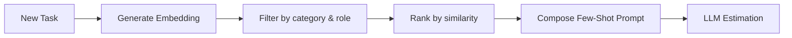

# Historical Context Builder

Few-shot prompting is only as good as the examples we surface. The history manager curates those examples automatically.

## Selection Logic
- Query includes description embedding + metadata filters (category, role) for high precision ([IMPLEMENTATION_SUMMARY.md:64](../../IMPLEMENTATION_SUMMARY.md:64)).
- Default similarity threshold `0.6` hits the balance between relevance and coverage; tune in `config.py` ([IMPLEMENTATION_SUMMARY.md:74](../../IMPLEMENTATION_SUMMARY.md:74); [ESTIMATION_HISTORY_GUIDE.md:142](../../ESTIMATION_HISTORY_GUIDE.md:142)).
- Max examples defaults to 5 for rich context without bloating tokens ([ESTIMATION_HISTORY_GUIDE.md:148](../../ESTIMATION_HISTORY_GUIDE.md:148)).

## Prompt Structure
```
## Historical Reference Examples:
Example 1 (Similarity: 0.92):
- Task: 見込データ作成 - 取引先コード入力
- Role: Backend
- Complexity: Medium
- Estimated Effort: 4.5 mandays
- Confidence: 0.85
...
```
([ESTIMATION_HISTORY_GUIDE.md:70](../../ESTIMATION_HISTORY_GUIDE.md:70))

## Transparency Features
- Similarity scores displayed for each example to help reviewers gauge relevance.
- Role, complexity, and confidence included so estimators can cross-check assumptions ([ESTIMATION_HISTORY_GUIDE.md:70](../../ESTIMATION_HISTORY_GUIDE.md:70)).

## Operational Tips
- Lower threshold to 0.5 when the history corpus is sparse or tasks are described tersely ([ESTIMATION_HISTORY_GUIDE.md:170](../../ESTIMATION_HISTORY_GUIDE.md:170)).
- If no matches appear, confirm the database is populated and consider broadening filters (see Operations → Known Issues & Recovery).



> With a clear understanding of the few-shot context, explore Delivery & Interfaces → Streamlit Touchpoints to see how results surface in the UI.
