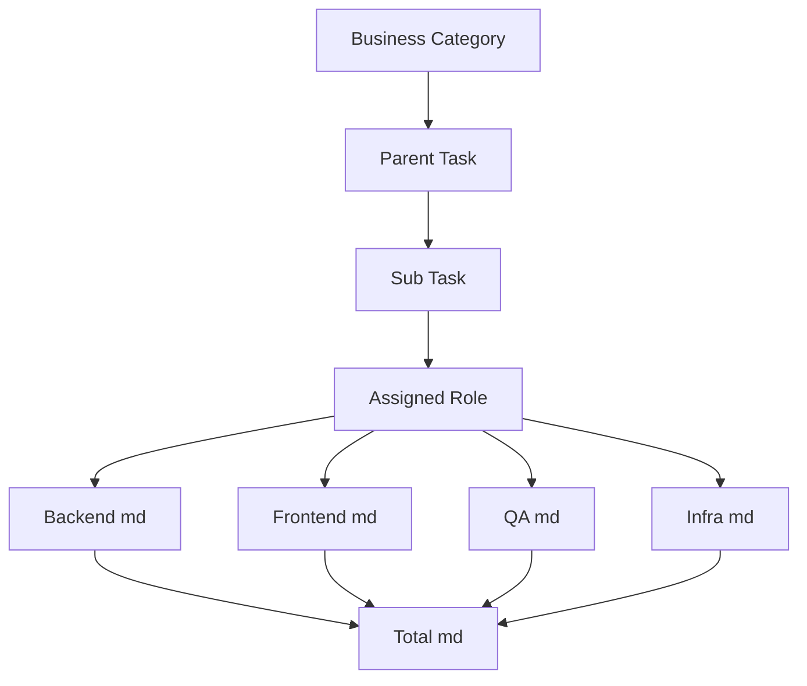

# Task Breakdown & Role Effort Rules

Business logic drives categories; technical roles drive effort fields.

## Category Strategy
- Categories represent functional domains (Authentication, Reporting, etc.), not technical stacks ([CHANGES.md:8](../../CHANGES.md:8)).
- Orchestrator prompt highlights business categories to keep stakeholders aligned with product value ([CHANGES.md:12](../../CHANGES.md:12)).

## Role Assignment
- `TaskBreakdown` dataclass now includes `role` (Backend, Frontend, QA, Infra) so each task clearly maps to a responsible discipline ([CHANGES.md:24](../../CHANGES.md:24)).
- Breakdown worker prompts ensure every generated task specifies a role that matches the required work type ([CHANGES.md:18](../../CHANGES.md:18)).

## Estimation Fields
- Role-specific manday fields: `estimation_backend_manday`, `estimation_frontend_manday`, `estimation_qa_manday`, `estimation_infra_manday` ([CHANGES.md:32](../../CHANGES.md:32)).
- `estimation_manday` equals the sum of role-specific effort, ensuring totals stay consistent ([CHANGES.md:34](../../CHANGES.md:34)).
- Estimation worker sets non-relevant role fields to 0 so reports remain clean ([CHANGES.md:40](../../CHANGES.md:40)).

## Validation Behaviour
- Validation worker applies proportional adjustments across all role fields when buffers or corrections are needed ([CHANGES.md:44](../../CHANGES.md:44)).
- Maintains role ratios while accommodating overall risk or contingency.

## Reporting Impact
- Excel export and Streamlit UI rely on these fields to display role distributions and support capacity planning ([CHANGES.md:64](../../CHANGES.md:64); [CHANGES.md:86](../../CHANGES.md:86)).

> Continue to Estimation Workflow → Historical Context Builder to learn how role metadata influences semantic search results.
