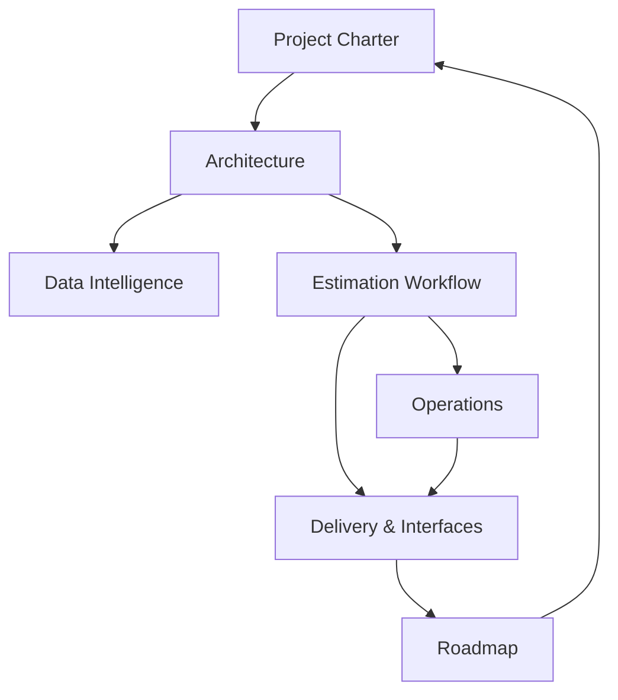

# Estimation History Knowledge Base

Welcome! This wiki distills the estimation-history initiative so the whole team can understand the business motivation, system architecture, operational routines, and roadmap at a glance. Start with the charter, then drill into architecture, workflow, and operations as needed.

| Parent Category | Subcategory | Post | Key Coverage |
| --- | --- | --- | --- |
| Project Charter | Vision & Outcomes | [Estimation History Purpose](project-charter/estimation-history-purpose.md) | Why the estimation history + few-shot system exists, delivered value, success criteria |
| Architecture | Component Overview | [Core Services & Dependencies](architecture/core-services-and-dependencies.md) | EmbeddingService, EstimationHistoryManager, migration scripts, system diagram |
| Architecture | Workflow Orchestration | [Estimation Worker Enhancements](architecture/estimation-worker-enhancements.md) | How the enhanced worker searches history, builds prompts, saves results |
| Architecture | Orchestrator Pattern | [LangGraph Workflow Design](architecture/langgraph-workflow-design.md) | Orchestrator vs workers responsibilities, breakdown/estimation/effort synthesis |
| Data Intelligence | Vector Store | [ChromaDB Schema & Operations](data-intelligence/chromadb-schema-and-operations.md) | Collection metadata, document structure, search thresholds, performance |
| Data Intelligence | Embedding Layer | [Embedding Service & Cache](data-intelligence/embedding-service-and-cache.md) | OpenAI model choice, caching strategy, batch handling, cost profile |
| Estimation Workflow | Process Steps | [End-to-End Estimation Flow](estimation-workflow/end-to-end-estimation-flow.md) | Task intake through history persistence with few-shot prompting |
| Estimation Workflow | Role Logic | [Task Breakdown & Role Effort Rules](estimation-workflow/task-breakdown-and-role-effort-rules.md) | Business-category focus, role fields, per-role estimation logic, validation rules |
| Estimation Workflow | Prompt Intelligence | [Historical Context Builder](estimation-workflow/historical-context-builder.md) | Few-shot prompt template, example selection, similarity tuning |
| Delivery & Interfaces | User Experience | [Streamlit Touchpoints](delivery-interfaces/streamlit-touchpoints.md) | UI updates, role metrics, stakeholder visibility |
| Delivery & Interfaces | Reporting | [Excel Export & Role Breakdown](delivery-interfaces/excel-export-and-role-breakdown.md) | Columns, secondary sheet, decision-support rationale |
| Operations | Setup | [Environment & Data Import Runbook](operations/environment-and-data-import-runbook.md) | Dependencies, env vars, migration command, expected output |
| Operations | Quality | [Test Harness Overview](operations/test-harness-overview.md) | Automated tests, coverage areas, execution guidance |
| Operations | Troubleshooting | [Known Issues & Recovery](operations/known-issues-and-recovery.md) | API key errors, empty results, cache checks, DB reset workflow |
| Roadmap | Enhancements | [Future Improvements Backlog](roadmap/future-improvements-backlog.md) | Accuracy tracking, project-specific learning, dashboards, filtering ideas |

> Need a quick start? Follow the links in Operations → Setup to get the system running, then review Architecture → Component Overview to understand how the pieces fit together.

