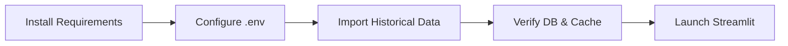

# Environment & Data Import Runbook

Set up the estimation history stack in three quick phases.

## 1. Install Dependencies
```bash
pip install -r requirements.txt
```
([ESTIMATION_HISTORY_GUIDE.md:28](../../ESTIMATION_HISTORY_GUIDE.md:28))

### Key Libraries
- `chromadb>=0.4.0` for vector storage.
- `openai>=1.0.0` for embedding + LLM access ([ESTIMATION_HISTORY_GUIDE.md:32](../../ESTIMATION_HISTORY_GUIDE.md:32)).

## 2. Configure Environment Variables
Create/update `.env`:
```env
OPENAI_API_KEY=sk-your-openai-api-key-here
OPENAI_MODEL=gpt-4o-mini
```
([ESTIMATION_HISTORY_GUIDE.md:34](../../ESTIMATION_HISTORY_GUIDE.md:34))

## 3. Import Historical Data
```bash
python migration_scripts/import_kyoest_history.py
```
([ESTIMATION_HISTORY_GUIDE.md:42](../../ESTIMATION_HISTORY_GUIDE.md:42))

Expected console output confirms parsed task count, import success, and sample search results ([ESTIMATION_HISTORY_GUIDE.md:48](../../ESTIMATION_HISTORY_GUIDE.md:48)).

## Directory Check
- `./estimation_history_db/` should appear after import.
- `./embedding_cache/` will populate during embedding generation ([ESTIMATION_HISTORY_GUIDE.md:208](../../ESTIMATION_HISTORY_GUIDE.md:208)).

## Ready to Run
- Launch the Streamlit app once data is in place:
  ```bash
  streamlit run app.py
  ```
  ([ESTIMATION_HISTORY_GUIDE.md:58](../../ESTIMATION_HISTORY_GUIDE.md:58))



> If any step fails, consult Operations → Known Issues & Recovery for targeted troubleshooting.
