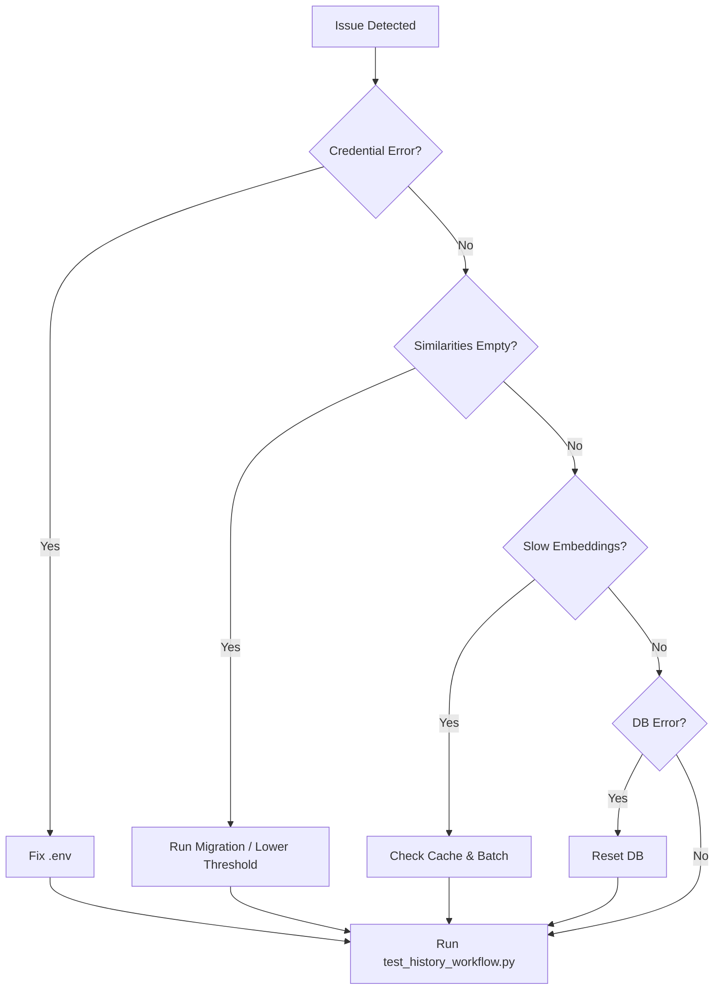

# Known Issues & Recovery

Keep this checklist handy when something feels off.

## OpenAI Credential Errors
- Symptom: `OPENAI_API_KEY not found` or API authentication failures.
- Resolution: Verify `.env` content matches expected format and environment loader picks it up ([ESTIMATION_HISTORY_GUIDE.md:178](../../ESTIMATION_HISTORY_GUIDE.md:178)).

## Empty Similarity Results
- Causes: Empty database, threshold too high, overly niche descriptions ([ESTIMATION_HISTORY_GUIDE.md:188](../../ESTIMATION_HISTORY_GUIDE.md:188)).
- Fixes:
  - Ensure migration script ran successfully (see Environment & Data Import Runbook).
  - Lower similarity threshold to ~0.5 for broader matches ([ESTIMATION_HISTORY_GUIDE.md:190](../../ESTIMATION_HISTORY_GUIDE.md:190)).
  - Enrich task descriptions with additional context.

## Slow Embedding Generation
- Causes: Cache directory missing, large batches of unique strings ([ESTIMATION_HISTORY_GUIDE.md:196](../../ESTIMATION_HISTORY_GUIDE.md:196)).
- Fixes:
  - Confirm `./embedding_cache/` exists and is writable.
  - Leverage batch embedding calls instead of single requests.

## Corrupted ChromaDB Store
- Symptom: Exceptions when reading or querying the vector database.
- Recovery:
  ```bash
  rm -rf ./estimation_history_db
  python migration_scripts/import_kyoest_history.py
  ```
  ([ESTIMATION_HISTORY_GUIDE.md:200](../../ESTIMATION_HISTORY_GUIDE.md:200))

## Workflow Integration Failures
- Use `python test_history_workflow.py` to isolate whether embedding, history, or prompt building is the culprit ([test_history_workflow.py:180](../../test_history_workflow.py:180)).
- Inspect console logs for the failing stage; rerun with verbose output if needed.



> Escalate recurring issues to the architecture team so we can fold learnings into the Roadmap → Future Improvements Backlog.
