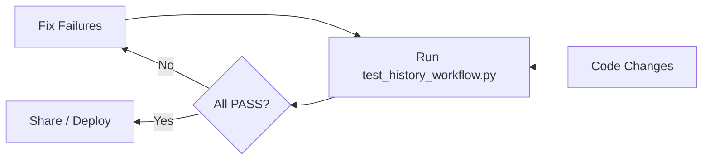

# Test Harness Overview

`test_history_workflow.py` validates that history-powered estimation behaves as expected before you ship changes.

## Coverage
1. **Embedding Service**: Generates single + batch embeddings, verifies cache reuse ([test_history_workflow.py:18](../../test_history_workflow.py:18)).
2. **History Manager**: Saves a sample task, runs semantic search, builds few-shot prompt, and prints stats ([test_history_workflow.py:64](../../test_history_workflow.py:64)).
3. **Workflow Integration**: Simulates the estimation worker path and ensures historical retrieval succeeds ([test_history_workflow.py:137](../../test_history_workflow.py:137)).

## Running Tests
```bash
python test_history_workflow.py
```
([IMPLEMENTATION_SUMMARY.md:150](../../IMPLEMENTATION_SUMMARY.md:150))

- Tests print detailed console logs to aid debugging.
- Expect partial skips if OpenAI API key is missing; the script warns accordingly ([test_history_workflow.py:150](../../test_history_workflow.py:150)).

## Success Criteria
- All three tests report ✅ PASS.
- Summary hints at next operational steps (import data, run Streamlit) when everything is green ([test_history_workflow.py:190](../../test_history_workflow.py:190)).

## When to Run
- After modifying history manager, embedding code, or estimation prompts.
- Before onboarding new teammates to confirm the environment works end-to-end.



> Pair these tests with manual Streamlit smoke checks for full confidence.
