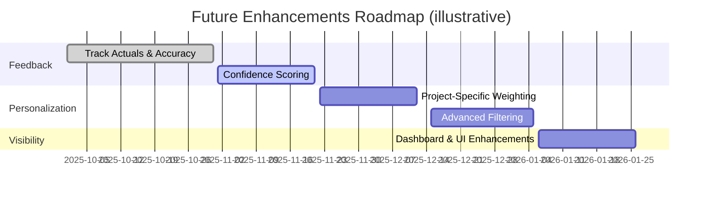

# Future Improvements Backlog

These ideas extend the estimation history system beyond its initial release ([IMPLEMENTATION_SUMMARY.md:204](../../IMPLEMENTATION_SUMMARY.md:204)).

## Accuracy & Feedback
- Track actual vs estimated effort to compute accuracy metrics and adjust thresholds dynamically ([IMPLEMENTATION_SUMMARY.md:214](../../IMPLEMENTATION_SUMMARY.md:214)).
- Incorporate confidence scoring refinements that reflect historical performance ([IMPLEMENTATION_SUMMARY.md:226](../../IMPLEMENTATION_SUMMARY.md:226)).

## Personalization
- Support project-specific collections or weighting so recent work influences results more heavily ([IMPLEMENTATION_SUMMARY.md:218](../../IMPLEMENTATION_SUMMARY.md:218)).
- Add advanced filters (tech stack, team experience, project size) to narrow comparable examples ([IMPLEMENTATION_SUMMARY.md:232](../../IMPLEMENTATION_SUMMARY.md:232)).

## Visibility
- Build dashboards that visualize estimation history, similarities used, and trend lines ([IMPLEMENTATION_SUMMARY.md:230](../../IMPLEMENTATION_SUMMARY.md:230)).
- Enhance UI to highlight confidence ranges and flag high-uncertainty tasks ([IMPLEMENTATION_SUMMARY.md:224](../../IMPLEMENTATION_SUMMARY.md:224)).

## Operational Excellence
- Automate reminders to import new historical data after each project milestone.
- Expand automated tests to cover actual vs estimated analytics once feature lands.

> Have a new improvement idea? Add it here with a short problem statement and the impacted stakeholders.
